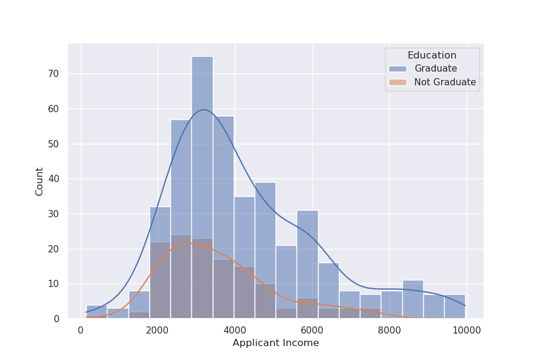
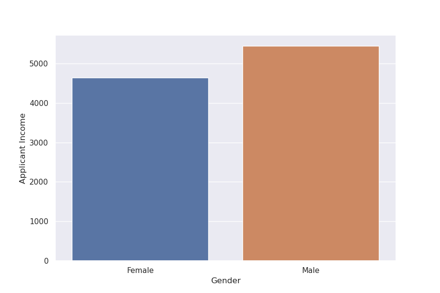
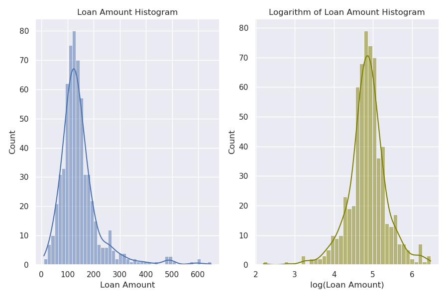
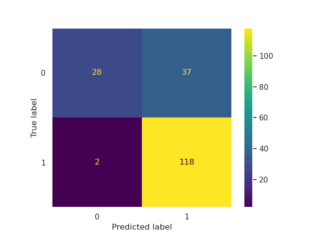

# Mini-project IV

### [Assignment](assignment.md)

## Project/Goals
In this project, the main goal is to deploy an ML model that automates the evaluation of loan applicants. Taking into account a number of different features, we would like to predict if a person will have a loan request approved. To do that, we employed a supervised machine learning method and deployed the model in the cloud so that it could be accessed by anyone. 

## Hypothesis
Prior to analyzing the data and building the model, it is important to develop hypotheses of which candidates are likely to get a loan approved. Below are some of these hypotheses: 

* **Candidates who possess a high credit score**. This would mean that the candidate has a good control of their finances and is dependable to pay back the loan. 
* **Candidates in a household with a high total income**. Having a higher income could mean the candidate is more likely to pay back the loan.
* **Candidates with a history of delayed payments**. Banks make money on interest, so it may be interesting to them to approve loans to customers who may have some difficulty in paying back a loan. _This is not something we can test with this dataset_.
* **Candidates who have been working with the financial institution for a long time**. For example, a bank could be more likely to approve a loan if they new the banking history of a client. A client could also have higher chances of having the loan approved thanks to their loyalty to a bank. 
* **Candidates who have had successful loans with this or other institutions**. An institution could look at this as an indication that the candidate is likely to pay back a loan. Imagine this as something like a referral.  
* **Candidates who are employed**. This is related to the second hypothesis - someone with some sort of income is more likely to pay back the loan. 

## EDA 
Different insights could be obtained by performing EDA. Some of these insights are presented below:
- The dataset is skewed when it comes to applicant income, and this could affect the model. For example, a few applicants have very high income, and as a result the mean and median of applicant income are quite different.  As a result, the distribution is not normal. 
- The property area does not seem to play a significant role. Average income, loan amount and term all seemed to be relatively close regardless of the property location.
- The income for graduates is significantly higher than that of non-graduates. However, when we look at the applicant income distribution for both categories, the distributions are actually quite similar. This can be seen in the histograms below.

- As expected, there is significant disparity in the average income of male and female applicants (see image below). However, this does not seem to impact the likelihood of having a loan approved. There could be instances where including gender is not recommended to avoid bias, but since this project is looking at historical data the gender feature was kept in the model. 

- Interestingly, there seems to be a strong relationship between credit history and loan status. This makes sense as institutions are more likely to approve a loan if they know the applicant is likely to pay it back.

## Process
Overall, the project could be split into several steps. 

### Hyptheses and EDA
The first step was coming up with a few hypotheses of what can affect the likelihood of a loan request being approved. Once that was done, visualizations were created to try and explore the hypotheses. Not all hypotheses could be explored, but they were still helpful in understanding the dataset. 

### Handling of Missing Data
Missing data was handled differently depending on the data type. For numerical data types, missing values were replaced with the mean. On the other hand, missing categorical entries were replaced with mode. 

### Feature Engineering
Feature engineering was necessary to better handle entries that might have been considered as outliers. For example, the logarithm of loan amount was used instead of simply loan amount, which resulted in the data being closer to a normal distribution (image below). Another example was combining applicant income and coapplicant income into total income and using the logarithm of that new feature. 

### Model Building
Having cleaned and engineered the data, it was possible to proceed with building the model. The algorithm used was RandomForestClassifier from sklearn. Optimization was done using GridSearchCV, where different classifier hyperparameters as well as scalers were considered. 

### Deploying the Model
To deploy the model, a very simple API was built using Flask. The API was deployed on AWS and can be successfully accessed using the URL
(http://ec2-44-202-249-124.compute-1.amazonaws.com:5000/scoring). Currently, only POST requests are accepted. The user must send JSON data with information about the applicant. The response returns both the probability that the loan will be approved (1) and rejected (0). The two are complimentary and should add to 1).

## Results/Demo
The performance of the model was compared before and after optimization. To analyze the performance, different metrics were used, such as accuracy, f1-score, and correlation matrices. After optimization, the model achieved an **f1-score** of **0.86** for approved requests. However, the f1-score for rejected requests was only **0.59**, so further optimization is needed. Below, the correlation matrix for the optimized model is presented. In this matrix, higher counts are represented in yellow (e.g. true positives), and dark blue corresponds to low counts (e.g. false negatives). 

## Challanges 
- Giving priority to the right parts of the project. A significant amount of time was spent imputing missing values with more elaborate methods, only to realize later that these could not be incorporated in the pipeline.
- Saving the model as a script after using pipeline. Initially, the script was created using processed data. Figuring out how to include the feature engineering steps in the pipeline was a big challenge.
- Understanding how to build an API using Flask. Currently, the API is rather limited, and the response is not ideal. 

## Future Goals
- Come up with more meaningful ways of treating the data and incorporating that in the pipeline using `FunctionTransformer()`.
- Changing the API script to return a single probability rather than a probability for approval and reproval, as they are redundant. 
- Develop a nicer API using HTML code - maybe the user could input values on the browser.